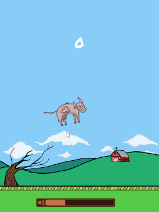

# Flappy Cow

A Flappy Bird clone written in [Beef](https://www.beeflang.org/).

  

# Dependancies

- [SDL2](https://www.libsdl.org/) For window creation, image loading, and drawing.
- [SDL2 Mixer](https://www.libsdl.org/projects/SDL_mixer/) For sound playback.
- [SDL2 TTF](https://www.libsdl.org/projects/SDL_ttf/) For font loading and drawing.

# Platforms

Runs only on Windows 10 (64-bit).

# How to run

Run `FlappyCow.exe` from `FlappyCow/bin/win64/`.

# How to compile

Download the [Beef IDE](https://www.beeflang.org/) and start it up, then go to File->Open->Open Project, then find and select `FlappyCow/BeefProj.toml`. You can then click Build->Build Workspace to compile.

# How to remove

Apart from the `.exe` and game files, your high score and volume settings are saved in `%APPDATA%/Blatnik/Flappy Cow/highscores.bin`. You can delete all of these files, or only the `.exe` and game files if you wish to keep your high score.
